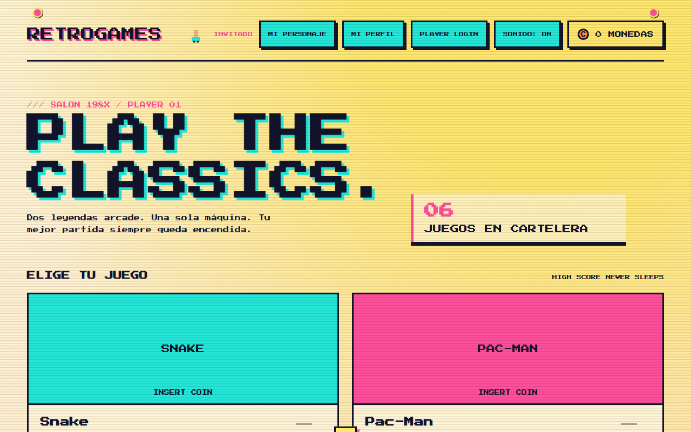
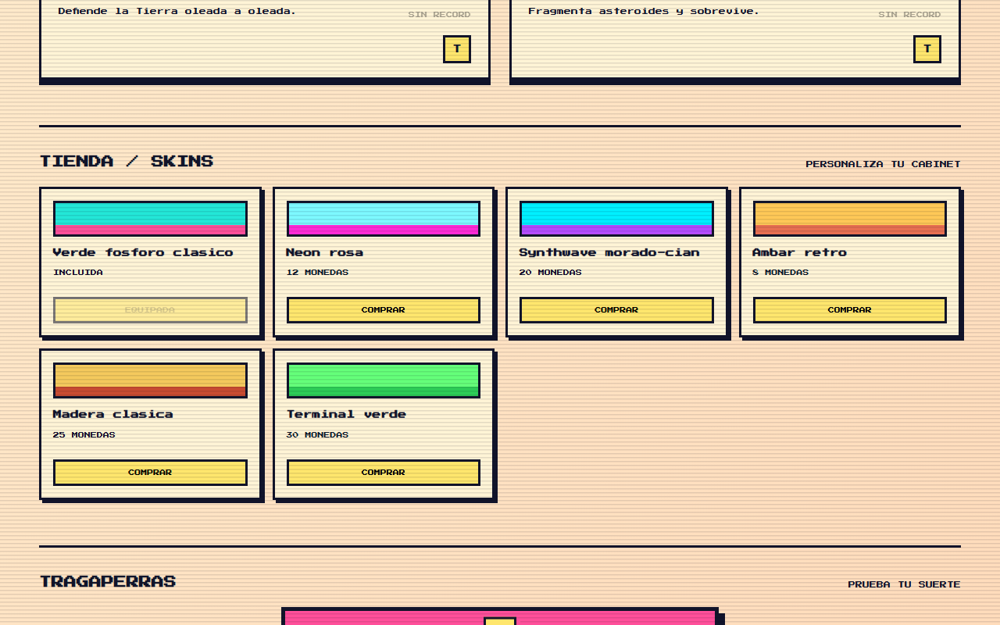
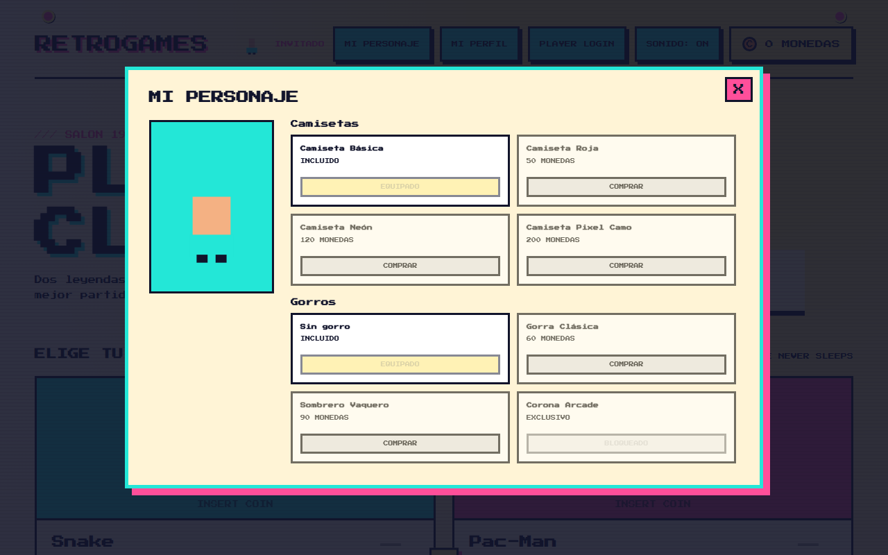
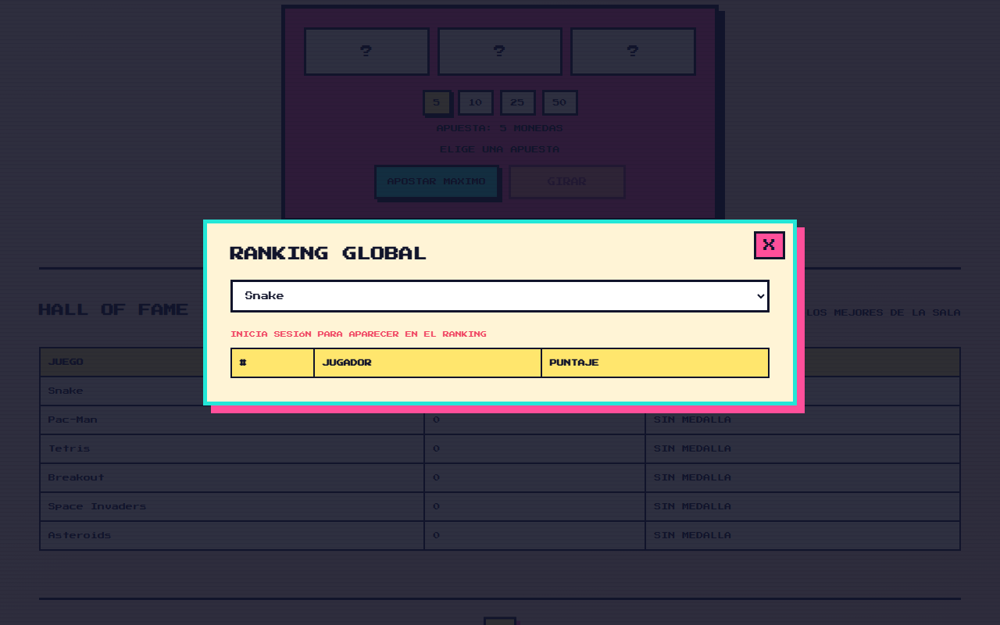

# RetroGames

[](https://github.com/lucasmarjua-ui/retrogames/actions/workflows/deploy.yaml)
[](LICENSE)
[](https://lucasmarjua-ui.github.io/retrogames/)


RetroGames es un portal web estático inspirado en los salones recreativos de los años 80. Reúne juegos arcade hechos con HTML, CSS, JavaScript vanilla y Canvas API, con una identidad visual común de neón, tipografía pixel-art y scanlines CRT sutiles.

**[▶ Jugar ahora](https://lucasmarjua-ui.github.io/retrogames/)**

## Capturas

| Portal principal | Tienda y tragaperras |
| --- | --- |
|  |  |

| Personaje personalizable | Ranking global |
| --- | --- |
|  |  |

## Jugar localmente

No hay dependencias ni build step. Se puede abrir `index.html` directamente en el navegador. Para una experiencia equivalente a GitHub Pages, sirve la raíz con cualquier servidor estático, por ejemplo:

```bash
python -m http.server 8000
```

Luego visita `http://localhost:8000`.

## Juegos actuales

- **Snake**: serpiente en grilla, manzana dorada, combos, velocidad creciente y movimiento suavizado.
- **Pac-Man**: laberinto con más de un diseño, fantasmas con comportamientos propios, frutas bonus y animaciones de asustado/comido.
- **Tetris**: pieza hold, cola de próximas piezas, pieza fantasma, wall kicks y bonus por combos/Tetris.
- **Breakout**: power-ups al romper bloques, varios diseños de nivel, ladrillos resistentes y combos.
- **Space Invaders**: invasores que aceleran, UFO bonus, búnkeres destructibles y oleadas crecientes.
- **Asteroids**: nave con inercia, asteroides que se dividen al impactar y oleadas crecientes.

Los controles son las flechas del teclado (más pausa con ESC y tutorial de controles la primera vez que se entra a cada juego). Cada partida actualiza su récord y puede otorgar monedas al wallet global.

## Cuentas y progreso

RetroGames funciona como invitado sin registro: las monedas, récords, skins, personaje y logros se guardan en `localStorage` y el jugador puede continuar jugando offline. Desde **PLAYER LOGIN** se puede crear una cuenta o iniciar sesión con **nombre de usuario y contraseña** (por debajo usa Firebase Authentication con un email generado internamente a partir del nombre de usuario, nunca se pide ni se muestra un email real). Al entrar, el progreso local se fusiona con el documento `users/{uid}` de Firestore y los cambios posteriores se guardan en ambos sitios. Cerrar sesión vuelve al modo invitado sin borrar los datos locales.

La `firebaseConfig` incluida es configuración pública de cliente, no un secreto. La seguridad real depende de las reglas de Firestore y de Authentication.

## Trofeos y logros

Cada juego tiene tres logros propios, con objetivos de bronce, plata y oro basados en acciones de juego además del puntaje. El botón `T` de cada tarjeta abre el detalle y muestra tanto los logros desbloqueados como los pendientes. Los desbloqueos se persisten en `localStorage` y se sincronizan con la cuenta Firebase cuando hay una sesión activa.

## Mi personaje

Cada jugador tiene un personaje personalizable (camisetas, gorros, gafas y accesorios) que se compra con monedas y aparece junto a su nombre en la cabecera del portal. Algunos artículos son exclusivos y se desbloquean automáticamente por logros de juego en vez de comprarse (por ejemplo, conseguir oro en los seis juegos clásicos o mantener una racha de siete días).

## Racha y tragaperras

El portal registra una racha diaria en `retrogames.streak` y entrega monedas al volver cada día, hasta un máximo de siete días de recompensa. La sección **TRAGAPERRAS** permite elegir cuánto apostar y girar tres carretes animados con premios por dos o tres símbolos iguales.

## Ranking global y perfil de jugador

El botón **RANKING GLOBAL** (junto al Hall of Fame) muestra el top 10 real de jugadores registrados por cada juego, leído en vivo desde una colección pública `leaderboards/{gameId}/entries` en Firestore; sin sesión iniciada se avisa de que hace falta una cuenta para aparecer en la lista. Cada jugador solo puede escribir su propia entrada (reglas de Firestore verificadas por `uid`), pero cualquier usuario autenticado puede leer el ranking completo. El botón **MI PERFIL** muestra nombre de usuario, fecha de registro, partidas totales, tiempo total jugado y el juego favorito de cada jugador, calculado a partir de `shared/stats.js` y sincronizado también con la cuenta Firebase.

## Arquitectura

```text
index.html                 Portal y selección de juegos
about.html                 Página de créditos e información del proyecto
games/<juego>/              Página y lógica de cada juego (Snake, Pac-Man, Tetris, Breakout, Space Invaders, Asteroids)
shared/theme.css           Variables, tipografía, layout y HUD visual
shared/wallet.js           Monedero global persistido en localStorage
shared/storage.js          Persistencia genérica namespaced por juego
shared/records.js          Récords y cálculo de medallas
shared/games-registry.js   Catálogo que consume el portal
shared/hud.js              Contrato común para score y monedas
shared/skins.js            Catálogo, compra y equipamiento de skins de cabinet
shared/character.js        Catálogo y estado del personaje personalizable
shared/audio.js            SFX y música chiptune sintetizados con Web Audio
shared/firebase-config.js  Configuración e inicialización del SDK Firebase CDN
shared/auth.js             Registro, login con usuario/contraseña, invitado y sincronización Firestore
shared/achievements.js     Catálogo y persistencia de logros por juego
shared/streak.js           Racha diaria y recompensa de monedas
shared/slot-machine.js     Lógica de la tragaperras con apuesta variable
shared/tutorial.js         Tutorial de controles por juego, una sola vez
shared/leaderboard.js      Envío y lectura del ranking global en Firestore
shared/stats.js            Estadísticas de juego (partidas, tiempo, favorito)
assets/                    Recursos opcionales (imagen de vista social, etc.)
```

### Cómo agregar un juego

1. Crea `games/<id>/index.html` y su script JavaScript con Canvas.
2. Importa `Wallet`, `mountHud`, `saveScore` y `getBestScore` desde `shared/`.
3. Añade una entrada a `shared/games-registry.js` con `id`, título, descripción, ruta, clase visual y umbrales `bronze`, `silver`, `gold`.
4. El portal mostrará automáticamente la nueva tarjeta y su medalla; no hace falta modificar `index.html`.

El wallet usa la clave global `retrogames.wallet`, mientras que los datos persistentes de cada juego viven bajo `retrogames.game-data` y su propio `gameId`. Así, cambiar de juego o cerrar el navegador no borra las monedas ni los mejores puntajes.

## Decisiones técnicas

**Sin build step ni frameworks.** Todo el proyecto es HTML, CSS y JavaScript vanilla con módulos ES nativos del navegador, incluido el SDK de Firebase, que se importa directo desde su CDN (`https://www.gstatic.com/firebasejs/...`) en vez de instalarse por npm. Esto permite que GitHub Pages sirva el repositorio tal cual, sin paso de compilación ni CI de build, y que cualquiera pueda clonar el repositorio y abrir `index.html` sin instalar nada.

**Cero archivos de audio o imagen externos.** El sonido se sintetiza en tiempo real con la Web Audio API (`shared/audio.js`) y el personaje/las skins se dibujan por código en vez de cargar sprites, para mantener el repositorio ligero y evitar dependencias de assets binarios.

**Arquitectura de módulos compartidos con registro central.** Cada juego es independiente, pero todos consumen los mismos módulos de `shared/` (monedero, récords, logros, audio, HUD). Añadir un juego nuevo consiste en crear su carpeta y una entrada en `games-registry.js`, sin tocar el portal.

**Cuentas opcionales, nunca obligatorias.** El progreso vive primero en `localStorage`; Firebase solo se usa para sincronizar entre dispositivos cuando el jugador decide crear una cuenta, y el login pide un nombre de usuario (no un email) para mantener la experiencia coherente con el resto del portal.

## GitHub Pages

El workflow `.github/workflows/deploy.yaml` publica los archivos estáticos en cada push a `main`, sin compilación. Después de crear el repositorio, activa Pages una sola vez en **Settings → Pages → Source: GitHub Actions**. Ese toggle no se puede configurar mediante Git.

El sitio está disponible en `https://lucasmarjua-ui.github.io/retrogames/`.

## Roadmap

Ideas futuras: soporte de PWA instalable, mando/gamepad, modo daltónico y volumen independiente de música/efectos.

## Licencia

MIT. Copyright Lucas Martinez, 2026. Ver [LICENSE](LICENSE).
