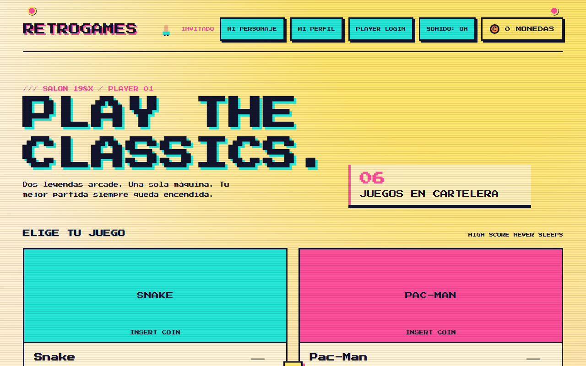
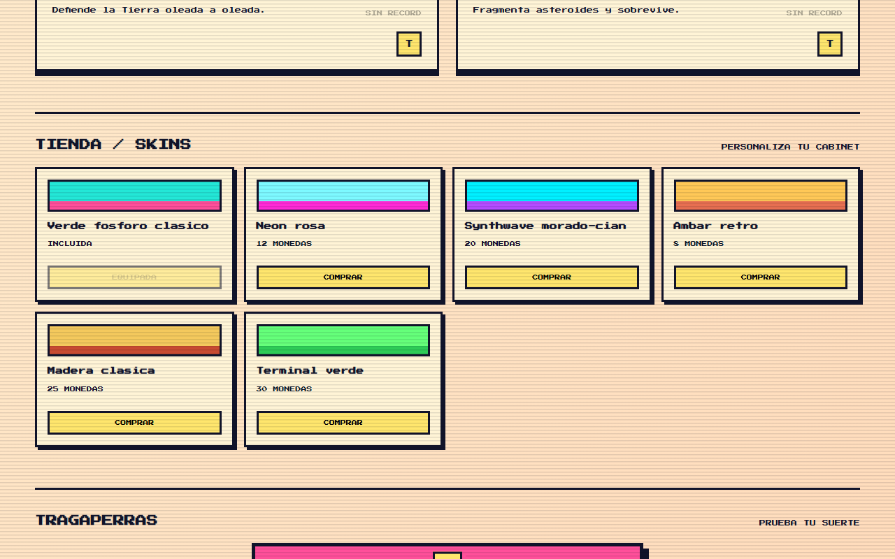
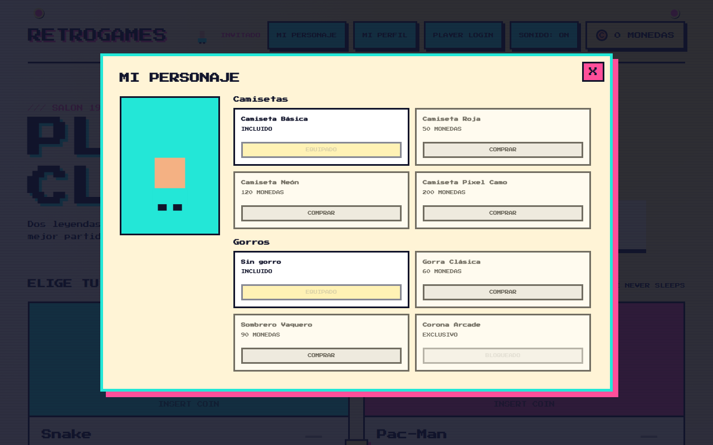
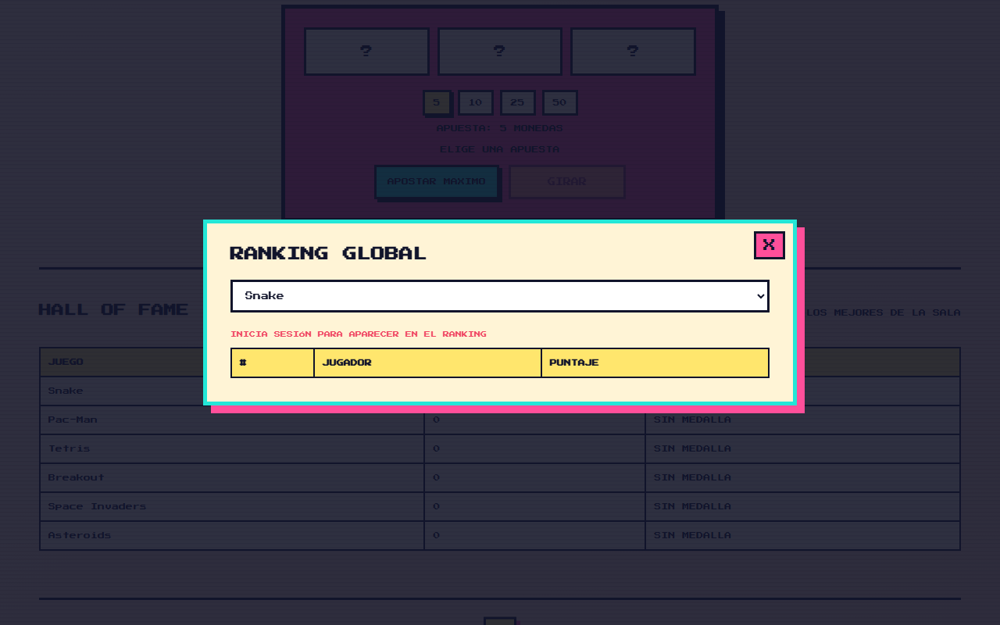

# RetroGames

[](https://github.com/lucasmarjua-ui/retrogames/actions/workflows/deploy.yaml)
[](LICENSE)
[](https://lucasmarjua-ui.github.io/retrogames/)


RetroGames is a static web portal inspired by 1980s arcades. It brings together six classic arcade games built with HTML, CSS, vanilla JavaScript and the Canvas API, sharing one visual identity: neon colours, pixel-art type and subtle CRT scanlines.

Built with no frameworks and no build step. The in-game interface is in Spanish.

**[▶ Play now](https://lucasmarjua-ui.github.io/retrogames/)**

## Screenshots

| Main portal | Shop and slot machine |
| --- | --- |
|  |  |

| Custom character | Global leaderboard |
| --- | --- |
|  |  |

## Contents

- [Play locally](#play-locally)
- [Games](#games)
- [Features](#features)
- [Architecture](#architecture)
- [Technical decisions](#technical-decisions)
- [Deployment](#deployment)
- [Roadmap](#roadmap)

## Play locally

There are no dependencies and no build step. The games use native ES modules, so serve the repository root with any static server:

```bash
python -m http.server 8000
```

Then visit `http://localhost:8000`.

## Games

| Game | Highlights |
| --- | --- |
| **Snake** | Grid movement with smoothing, golden apples, combos and increasing speed. |
| **Pac-Man** | Several maze layouts, ghosts with their own behaviours, bonus fruit and frightened/eaten animations. |
| **Tetris** | Hold piece, next-piece queue, ghost piece, wall kicks and combo/Tetris bonuses. |
| **Breakout** | Power-ups from broken bricks, several level layouts, tougher bricks and combos. |
| **Space Invaders** | Accelerating invaders, bonus UFO, destructible bunkers and growing waves. |
| **Asteroids** | Ship with inertia, asteroids that split on impact and growing waves. |

All games use the arrow keys, with **Esc** to pause and a controls tutorial the first time each game is opened. Every run updates the game's high score and can award coins to the shared wallet.

## Features

### Accounts and progress

RetroGames is fully playable as a guest: coins, high scores, skins, character and achievements are stored in `localStorage`, so it also works offline. **PLAYER LOGIN** lets players sign up or log in with a **username and password**. Under the hood this uses Firebase Authentication with an email generated from the username; a real email is never requested or shown. On login, local progress is merged into the player's `users/{uid}` Firestore document and later changes are saved to both. Logging out returns to guest mode without deleting local data.

The bundled `firebaseConfig` is public client configuration, not a secret. Security is enforced by Firestore security rules and Authentication.

### Achievements

Each game has three achievements with bronze, silver and gold goals based on in-game actions as well as score. The `T` button on each game card opens the details, showing unlocked and pending achievements. Unlocks are stored in `localStorage` and synced to the player's account when logged in.

### Custom character

Every player has a customisable character (shirts, hats, glasses and accessories) bought with coins and shown next to their name in the portal header. Some items are exclusive and unlock automatically through achievements instead of being bought, such as earning gold in all six games or keeping a seven-day streak.

### Daily streak and slot machine

The portal tracks a daily streak in `retrogames.streak` and awards coins for coming back each day, up to seven days of rewards. The **slot machine** section lets players choose a bet and spin three animated reels, paying out for two or three matching symbols.

### Global leaderboard and player profile

The **global leaderboard** button (next to the Hall of Fame) shows the real top 10 registered players for each game, read live from a public `leaderboards/{gameId}/entries` collection in Firestore. Guests are told they need an account to appear on it. Firestore rules check the `uid`, so each player can only write their own entry, while any signed-in player can read the full ranking.

**My profile** shows the username, sign-up date, total games played, total play time and favourite game, calculated in `shared/stats.js` and also synced to the player's account.

## Architecture

```text
index.html                 Portal and game selection
about.html                 Credits and project information
games/<game>/              Page and logic for each game
shared/theme.css           Design tokens, typography, layout and HUD styles
shared/wallet.js           Shared coin wallet stored in localStorage
shared/storage.js          Generic per-game namespaced storage
shared/records.js          High scores and medal thresholds
shared/games-registry.js   Game catalogue used by the portal
shared/hud.js              Shared score and coin HUD
shared/skins.js            Cabinet skin catalogue, purchases and equipping
shared/character.js        Character catalogue and state
shared/audio.js            Chiptune music and sound effects synthesised with Web Audio
shared/firebase-config.js  Firebase config and lazy SDK loader
shared/auth.js             Sign-up, login, guest mode and Firestore sync
shared/achievements.js     Per-game achievement catalogue and storage
shared/streak.js           Daily streak and coin reward
shared/slot-machine.js     Slot machine logic with variable bets
shared/tutorial.js         One-time controls tutorial per game
shared/leaderboard.js      Global leaderboard reads and writes
shared/stats.js            Play statistics (games, time, favourite)
assets/                    Static images
```

### Adding a game

1. Create `games/<id>/index.html` and its Canvas script.
2. Import `Wallet`, `mountHud`, `saveScore` and `getBestScore` from `shared/`.
3. Add an entry to `shared/games-registry.js` with its `id`, title, description, path, visual class and `bronze`, `silver` and `gold` thresholds.
4. The portal shows the new card and its medal automatically, with no changes to `index.html`.

The wallet uses the global `retrogames.wallet` key, while each game's data lives under `retrogames.game-data` keyed by its `gameId`. Switching games or closing the browser never loses coins or high scores.

## Technical decisions

**No build step or frameworks.** The whole project is HTML, CSS and vanilla JavaScript using native ES modules. GitHub Pages serves the repository as-is, and anyone can clone it and run it without installing anything.

**Firebase is loaded lazily.** The Firebase SDK comes from Google's CDN through a dynamic `import()` in `shared/firebase-config.js`, never a static import. If the CDN is blocked by an ad blocker, a corporate proxy or a lost connection, the portal and every game still load and play as a guest; only accounts, sync and the leaderboard are switched off.

**No external audio or image files for gameplay.** Sound is synthesised in real time with the Web Audio API (`shared/audio.js`), and the character and skins are drawn in code instead of loaded as sprites. This keeps the repository light and free of binary assets.

**Shared modules with a central registry.** Each game is independent, but all of them use the same `shared/` modules (wallet, records, achievements, audio, HUD). Adding a game means creating its folder and one entry in `games-registry.js`, without touching the portal.

**Accounts are optional.** Progress lives in `localStorage` first. Firebase is only used to sync across devices once a player chooses to create an account, and login asks for a username rather than an email to keep the arcade feel.

## Deployment

The `.github/workflows/deploy.yaml` workflow publishes the static files to GitHub Pages on every push to `main`, with no build. Pages must be enabled once under **Settings → Pages → Source: GitHub Actions**.

The site is live at <https://lucasmarjua-ui.github.io/retrogames/>.

## Roadmap

- Installable PWA support
- Gamepad support
- Colour-blind friendly mode
- Separate music and sound-effect volume controls

## License

MIT. Copyright Lucas Martinez, 2026. See [LICENSE](LICENSE).
